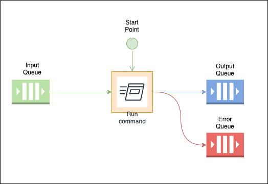

<!-- Docs links -->
<p align="center">
  <a href="http://rallf.com">
    
  </a>
</p>
<h1 align="center">rallf-ce-runner</h1>

<div align="center">
  <p>
    Runs any command, and sends <code>stdout</code> to a RabbitMQ queue and writes to <code>stdin</code> any message from a queue.
  </p>
  <i>**Notice:** this is a tool made internally for <a href="">rallf-ce</a> and is not intented for use independently -- use at your own risk</i>
</div>

****

**Disclaimer! This package is in development stage (unstable), it may be potentially buggy**


## Usage
Using bin file with arguments:
```sh
   node bin/rallf-ce-runner.js pipe --debug --name=test --cmd="rallf-js run -t ./test-task/basic-example"
```

Using from code:
```js
const runnerMain = require('./main.js');
runnerMain({
  cmd: `rallf-js run -t ./test-task/basic-example`,

  // You can pass in the name of the queue
  // this will generate 3 queues, in, out, error
  name: 'test',

  // or you can pass in the queues your self
  in: 'test:in',
  out: 'test:out',
  error: 'test:error',

  // Set debug
  debug: true,
}).then((connection) => {
  console.log('connection');
  // You can access RabbitMQ connection here
});
```


Will listen in queue, and will post anytihng to output queue.


