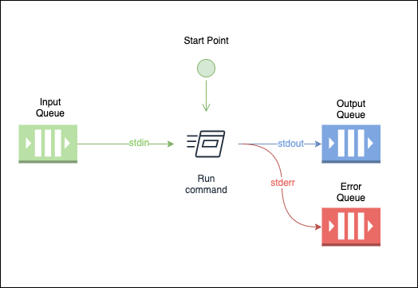

<!-- Docs links -->
<p align="center">
  <a href="http://rallf.com">
    
  </a>
</p>
<h1 align="center">rallf-ce-runner</h1>

<div align="center">
  <p>Pipes sdk std output to a RabbitMQ output queue as rpc, and receives input from a RabbitMQ input queue.</p>
</div>

****


Basic Usage:
```sh
    DEBUG=true node bin/rallf-ce-runner.js pipe -v --name=test --cmd="rallf-js run -t ./test-task/basic-example"
```

Will listen in queue, and will post anytihng to output queue.


